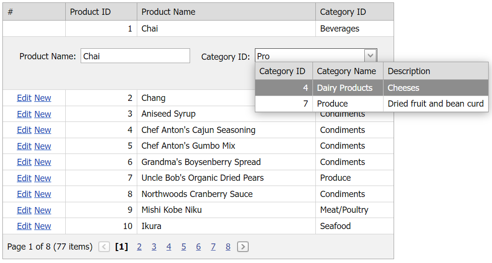

<!-- default badges list -->

[](https://supportcenter.devexpress.com/ticket/details/E3653)
[](https://docs.devexpress.com/GeneralInformation/403183)
[](#does-this-example-address-your-development-requirementsobjectives)
<!-- default badges end -->
# Grid View for ASP.NET Web Forms - How to edit grid data using a two-way data-bound grid lookup in dynamic item load mode

This example demonstrates how to add a grid lookup editor to a column edit item template, bind the editor to a large data source, and enable its dynamic item load mode.



## Overview

Create a combo box column and specify its [EditItemTemplate](https://docs.devexpress.com/AspNet/DevExpress.Web.GridViewDataColumn.EditItemTemplate) property. Add a grid lookup control to the template, bind it to a [LinqServerModeDataSorce](https://docs.devexpress.com/AspNet/DevExpress.Data.Linq.LinqServerModeDataSource), and use the [Bind](https://learn.microsoft.com/en-us/previous-versions/aspnet/ms178366(v=vs.100)#using-the-bind-method) method to bind the control's `Value` property to the corresponding field in the main grid's data source.

```aspx
<dx:ASPxGridView ID="ASPxGridView1" runat="server" DataSourceID="SqlDataSource1" KeyFieldName="ProductID"
    AutoGenerateColumns="False" ClientIDMode="AutoID" >
    <Columns>
        <!-- ... -->
        <dx:GridViewDataComboBoxColumn FieldName="CategoryID" VisibleIndex="2">
            <PropertiesComboBox TextField="CategoryName" ValueField="CategoryID" ValueType="System.String"
                IncrementalFilteringMode="Contains" EnableCallbackMode="true" CallbackPageSize="7"
                OnItemRequestedByValue="ItemRequestedByValue"
                OnItemsRequestedByFilterCondition="ItemsRequestedByFilterCondition">
            </PropertiesComboBox>
            <EditItemTemplate>
                <dx:ASPxGridLookup ID="ASPxGridLookup1" runat="server" KeyFieldName="CategoryID"
                    AutoGenerateColumns="False" DataSourceID="LinqServerModeDataSource1" 
                    TextFormatString="{1}" Value='<%# Bind("CategoryID") %>'
                    IncrementalFilteringMode="Contains">
                    <GridViewProperties>
                        <SettingsBehavior AllowFocusedRow="True" AllowSelectSingleRowOnly="True" />
                    </GridViewProperties>
                    <Columns>
                        <!-- ... -->
                    </Columns>
                </dx:ASPxGridLookup>
            </EditItemTemplate>
        </dx:GridViewDataComboBoxColumn>
    </Columns>
</dx:ASPxGridView>
```

Set the column's [EnableCallbackMode](https://docs.devexpress.com/AspNet/DevExpress.Web.ASPxAutoCompleteBoxBase.EnableCallbackMode) property to `true` to enable the [database server mode](https://docs.devexpress.com/AspNet/3787/components/data-editors/common-concepts/binding-to-data#binding-to-large-data-database-server-mode) and handle the following server-side events to dynamically load items in the grid lookup:

* [ASPxComboBox.ItemRequestedByValue](https://docs.devexpress.com/AspNet/DevExpress.Web.ASPxComboBox.ItemRequestedByValue) event obtains selected items specified by their values.
* [ASPxComboBox.ItemsRequestedByFilterCondition](https://docs.devexpress.com/AspNet/DevExpress.Web.ASPxComboBox.ItemsRequestedByFilterCondition) event selects items by filter conditions.

```cs
public void ItemRequestedByValue(object source, DevExpress.Web.ListEditItemRequestedByValueEventArgs e){
    int value = 0;
    if(e.Value == null || !Int32.TryParse(e.Value.ToString(), out value))
        return;
    ASPxComboBox comboBox = (ASPxComboBox)source;
    DataClassesDataContext dataContext = new DataClassesDataContext();
    int id = Int32.Parse(e.Value.ToString());
    var query = from category in dataContext.Categories
                where category.CategoryID == id
                select category;
    var count = query.Count();
    comboBox.DataSource = query;
    comboBox.DataBind();
}

public void ItemsRequestedByFilterCondition(object source, DevExpress.Web.ListEditItemsRequestedByFilterConditionEventArgs e){
    ASPxComboBox comboBox = (ASPxComboBox)source;
    var skip = e.BeginIndex;
    var take = e.EndIndex - e.BeginIndex + 1;
    DataClassesDataContext dataContext = new DataClassesDataContext();
    var queryStartWidth =
        (from category in dataContext.Categories
            where category.CategoryName.StartsWith(e.Filter)
            orderby category.CategoryName
            select category).Skip(skip).Take(take);
    comboBox.DataSource = queryStartWidth;
    comboBox.DataBind();
}
```

## Files to Review

* [Default.aspx](./CS/WebSite/Default.aspx) (VB: [Default.aspx](./VB/WebSite/Default.aspx))
* [Default.aspx.cs](./CS/WebSite/Default.aspx.cs) (VB: [Default.aspx.vb](./VB/WebSite/Default.aspx.vb))

## Documentation

* [Item Load Modes](https://docs.devexpress.com/AspNet/8205/components/data-editors/aspxcombobox/concepts/item-loading-modes)
* [Binding to Large Data (Database Server Mode)](https://docs.devexpress.com/AspNet/3787/components/data-editors/common-concepts/binding-to-data#binding-to-large-data-database-server-mode)
 *[Bind Grid View to Large Data (XPO)](https://docs.devexpress.com/AspNet/3726/components/grid-view/concepts/bind-to-data/binding-to-large-data-database-server-mode/data-binding-to-large-data-via-xpo)
<!-- feedback -->
## Does this example address your development requirements/objectives?

[](https://www.devexpress.com/support/examples/survey.xml?utm_source=github&utm_campaign=asp-net-web-forms-grid-edit-data-using-two-way-bound-lookup-in-dynamic-item-load-mode&~~~was_helpful=yes) [](https://www.devexpress.com/support/examples/survey.xml?utm_source=github&utm_campaign=asp-net-web-forms-grid-edit-data-using-two-way-bound-lookup-in-dynamic-item-load-mode&~~~was_helpful=no)

(you will be redirected to DevExpress.com to submit your response)
<!-- feedback end -->
